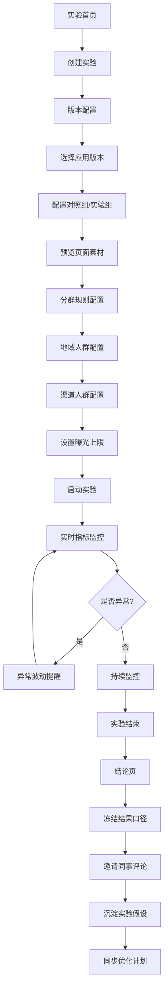

## 1. 产品概述

灰度 A/B 测试平台是面向移动应用运营人员的实验管理工具，用于验证新功能入口、弹窗文案和会员权益展示效果，通过数据驱动决策提升产品转化与用户体验。

- **目标用户**：移动应用运营人员、产品经理、增长团队
- **核心价值**：降低实验门槛、提升决策效率、沉淀实验方法论

## 2. 核心功能

### 2.1 用户角色

| 角色 | 登录方式 | 核心权限 |
|------|----------|----------|
| 运营人员 | 企业账号登录 | 创建实验、配置参数、查看数据、结束实验 |
| 产品经理 | 企业账号登录 | 查看实验数据、评论实验、沉淀结论 |
| 管理员 | 企业账号登录 | 所有权限 + 用户管理 |

### 2.2 功能模块

1. **实验首页**：实验概览卡片、进行中/已结束实验列表、关键指标趋势
2. **版本配置**：应用版本选择、对照组/实验组配置、页面素材预览
3. **分群规则**：地域人群配置、渠道人群配置、曝光上限设置
4. **实时指标**：点击率监控、留存变化、异常波动提醒
5. **结论页**：手动结束实验、冻结结果口径、同事评论、假设沉淀、同步优化计划

### 2.3 页面详情

| 页面名称 | 模块名称 | 功能描述 |
|-----------|-------------|---------------------|
| 实验首页 | 顶部导航 | Logo、全局搜索、用户头像、消息通知 |
| 实验首页 | 数据概览卡片 | 进行中实验数、今日曝光量、平均点击率、7日留存率 |
| 实验首页 | 实验列表 | Tab切换（全部/进行中/已结束）、实验卡片、筛选搜索 |
| 实验首页 | 快捷操作 | 创建实验按钮、最近访问实验 |
| 版本配置 | 应用版本选择 | 下拉选择应用版本、版本号展示、版本说明 |
| 版本配置 | 分组管理 | 对照组/实验组卡片、流量分配、分组名称编辑 |
| 版本配置 | 素材预览 | 功能入口预览、弹窗文案预览、会员权益预览、设备模拟 |
| 分群规则 | 地域配置 | 省份/城市选择、全国/自定义切换、已选地域标签 |
| 分群规则 | 渠道配置 | 应用商店/推广渠道选择、渠道分组管理 |
| 分群规则 | 曝光上限 | 日曝光上限、总曝光上限、人群比例设置 |
| 实时指标 | 核心指标卡 | 曝光量、点击率、转化率、留存率 |
| 实时指标 | 趋势图表 | 折线图对比、时间维度切换、指标对比 |
| 实时指标 | 异常提醒 | 异常波动标识、波动原因分析、告警设置 |
| 结论页 | 实验状态 | 进行中/已结束状态、实验周期、运行时长 |
| 结论页 | 结果概览 | 胜负判定、置信度、核心指标对比表格 |
| 结论页 | 评论区 | 评论列表、@同事、评论回复 |
| 结论页 | 假设沉淀 | 实验假设输入、结论总结、经验标签 |
| 结论页 | 优化计划 | 关联后续迭代、同步到需求池、导出报告 |

## 3. 核心流程

用户从实验首页开始，可查看所有实验的概览数据；点击创建实验后进入版本配置页，选择应用版本并设置对照组与实验组的素材；接着进入分群规则页，配置目标人群的地域、渠道和曝光上限；实验运行后，运营人员通过实时指标页监控数据变化，关注异常波动提醒；实验达到预期或结束后，在结论页手动结束实验、冻结结果口径，邀请同事评论讨论，沉淀实验假设和结论，并将结果同步到后续优化计划中。

## 4. 用户界面设计

### 4.1 设计风格

- **主色调**：深蓝青色（#0EA5E9）作为科技感主色，代表数据与洞察
- **辅助色**：翡翠绿（#10B981）表示正向增长与实验组胜，橙红色（#F97316）表示警示与波动
- **中性色**：深灰（#1E293B）作为主文本，中灰（#64748B）作为次文本，浅灰（#F1F5F9）作为背景
- **按钮风格**：圆角 8px，主按钮使用渐变填充，次要按钮使用描边样式
- **字体**：使用现代无衬线字体，标题使用中粗字重，正文使用常规字重
- **布局风格**：卡片式布局，清晰的信息层级，充足的留白空间
- **图标风格**：线性图标，统一的 24px 尺寸，与主色调保持一致

### 4.2 页面设计概述

| 页面名称 | 模块名称 | UI元素 |
|-----------|-------------|----------|
| 实验首页 | 数据概览卡片 | 渐变背景、数据动效、趋势箭头、图标装饰 |
| 实验首页 | 实验列表 | 卡片网格布局、状态标签、进度条、悬浮效果 |
| 版本配置 | 素材预览 | 设备模拟器框架、左右对比布局、Tab切换 |
| 版本配置 | 分组管理 | 流量分配滑块、分组卡片、颜色标识 |
| 分群规则 | 地域配置 | 标签式选择、搜索框、已选标签可删除 |
| 实时指标 | 趋势图表 | 双折线对比、图例交互、时间筛选器 |
| 实时指标 | 异常提醒 | 警示卡片、脉冲动画、原因标签 |
| 结论页 | 结果展示 | 胜负状态大卡片、置信度进度条、数据表格 |
| 结论页 | 评论区 | 头像气泡、时间戳、回复层级 |

### 4.3 响应式

- 采用桌面端优先设计，适配 1440px、1024px 主流宽度
- 侧边栏在小屏可折叠为图标模式
- 卡片网格在中等屏幕自动调整列数
- 表格在小屏转为卡片式展示
- 触控区域最小 44px，优化移动端操作

### 4.4 动效与交互

- 页面加载采用渐入 + 上移动画，元素依次亮相
- 数据变化时采用数字滚动动画
- 图表数据切换有平滑过渡效果
- 按钮和卡片有悬浮态和点击态反馈
- 异常提醒卡片带有呼吸脉冲动画
