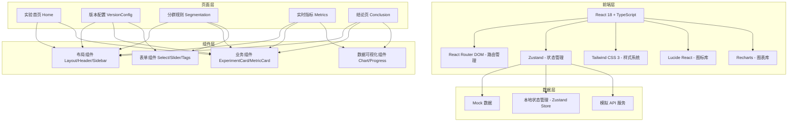
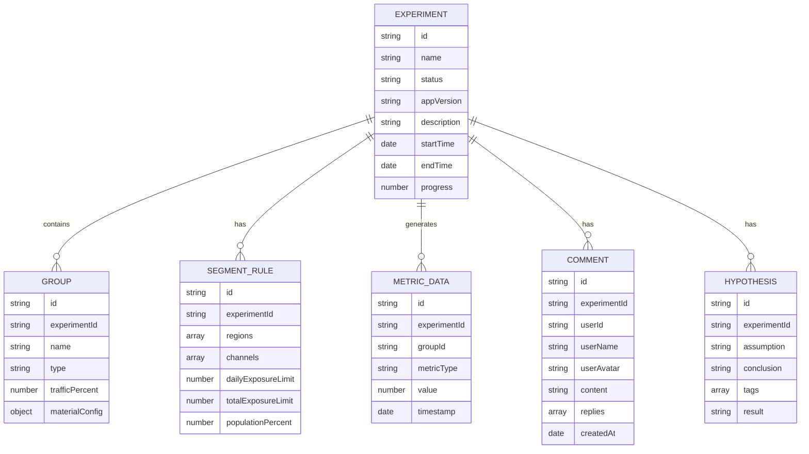

## 1. 架构设计



## 2. 技术描述

- **前端框架**：React@18 + TypeScript
- **构建工具**：Vite@5
- **路由管理**：react-router-dom@6
- **状态管理**：zustand@4
- **样式方案**：tailwindcss@3
- **图标库**：lucide-react
- **图表库**：recharts
- **后端**：无后端，使用 Mock 数据模拟
- **数据持久化**：localStorage 存储实验配置

## 3. 路由定义

| 路由 | 页面 | 说明 |
|-------|------|------|
| / | 实验首页 | 概览数据 + 实验列表 |
| /experiments | 实验首页 | 实验列表（同首页） |
| /experiments/:id/version | 版本配置 | 应用版本、分组配置、素材预览 |
| /experiments/:id/segmentation | 分群规则 | 地域、渠道、曝光上限 |
| /experiments/:id/metrics | 实时指标 | 数据监控、异常提醒 |
| /experiments/:id/conclusion | 结论页 | 结果、评论、假设、优化计划 |

## 4. 数据模型

### 4.1 数据模型定义



### 4.2 类型定义

```typescript
// 实验状态
type ExperimentStatus = 'draft' | 'running' | 'paused' | 'ended';

// 实验
interface Experiment {
  id: string;
  name: string;
  description: string;
  status: ExperimentStatus;
  appVersion: string;
  appName: string;
  startTime: string;
  endTime?: string;
  createdAt: string;
  progress: number;
}

// 实验组
interface ExperimentGroup {
  id: string;
  name: string;
  type: 'control' | 'variant';
  trafficPercent: number;
  materialConfig: MaterialConfig;
}

// 素材配置
interface MaterialConfig {
  entryConfig: EntryConfig;
  popupConfig: PopupConfig;
  benefitConfig: BenefitConfig;
}

// 功能入口配置
interface EntryConfig {
  icon: string;
  title: string;
  position: string;
  style: string;
}

// 弹窗配置
interface PopupConfig {
  title: string;
  content: string;
  buttonText: string;
  imageUrl?: string;
}

// 会员权益配置
interface BenefitConfig {
  title: string;
  benefits: string[];
  priceText: string;
}

// 分群规则
interface SegmentRule {
  regions: string[];
  channels: string[];
  dailyExposureLimit: number;
  totalExposureLimit: number;
  populationPercent: number;
}

// 指标数据
interface MetricData {
  date: string;
  control: number;
  variant: number;
}

// 核心指标
interface CoreMetrics {
  impressions: number;
  clicks: number;
  clickRate: number;
  conversionRate: number;
  retention7d: number;
}

// 评论
interface Comment {
  id: string;
  userId: string;
  userName: string;
  userAvatar: string;
  content: string;
  createdAt: string;
  replies?: Comment[];
}

// 实验假设
interface Hypothesis {
  id: string;
  assumption: string;
  conclusion: string;
  tags: string[];
  result: 'positive' | 'negative' | 'neutral';
}
```

## 5. 状态管理设计

使用 Zustand 管理全局状态，按功能模块划分 store：

- **useExperimentStore**：实验列表、当前实验、实验操作
- **useGroupStore**：分组配置、素材管理
- **useSegmentStore**：分群规则、人群配置
- **useMetricsStore**：指标数据、趋势图表
- **useCommentStore**：评论列表、评论操作

## 6. 组件设计原则

- 单一职责：每个组件只负责一个功能
- 可复用性：通用组件提取到 components 目录
- 类型安全：所有组件使用 TypeScript 类型定义
- 样式统一：使用 Tailwind CSS 原子类，保持设计一致性
- 性能优化：合理使用 useMemo、useCallback
